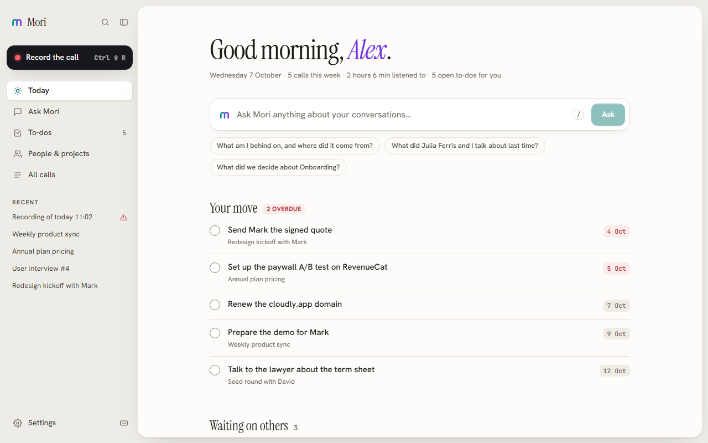
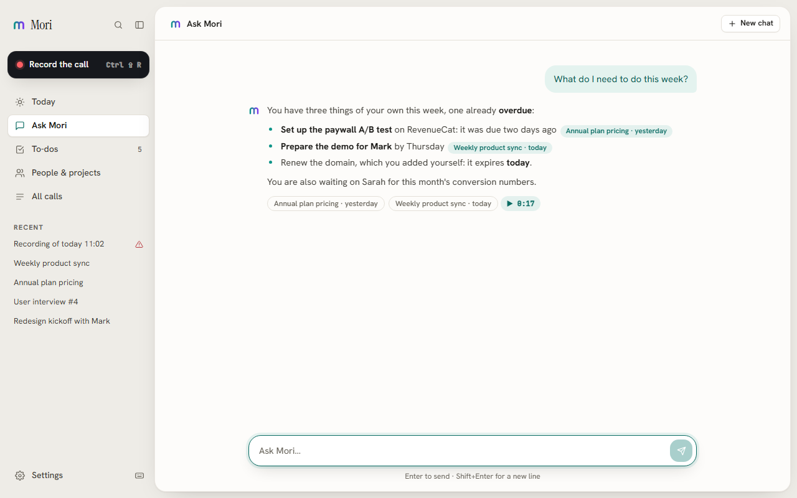
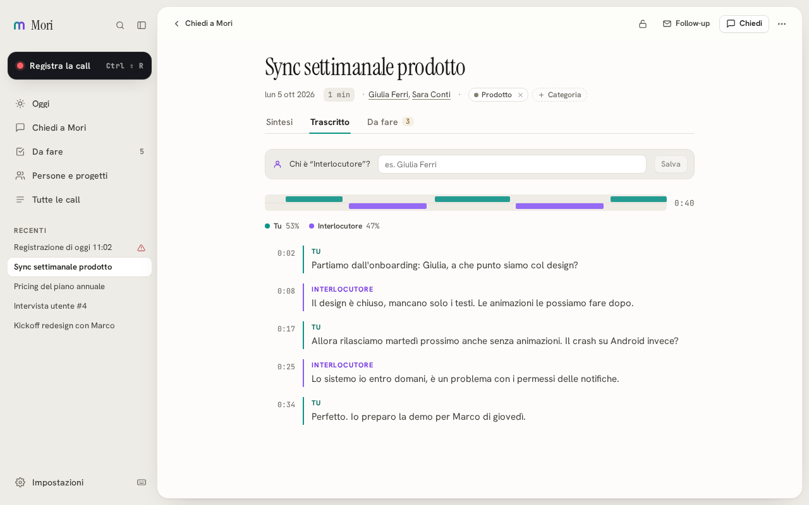
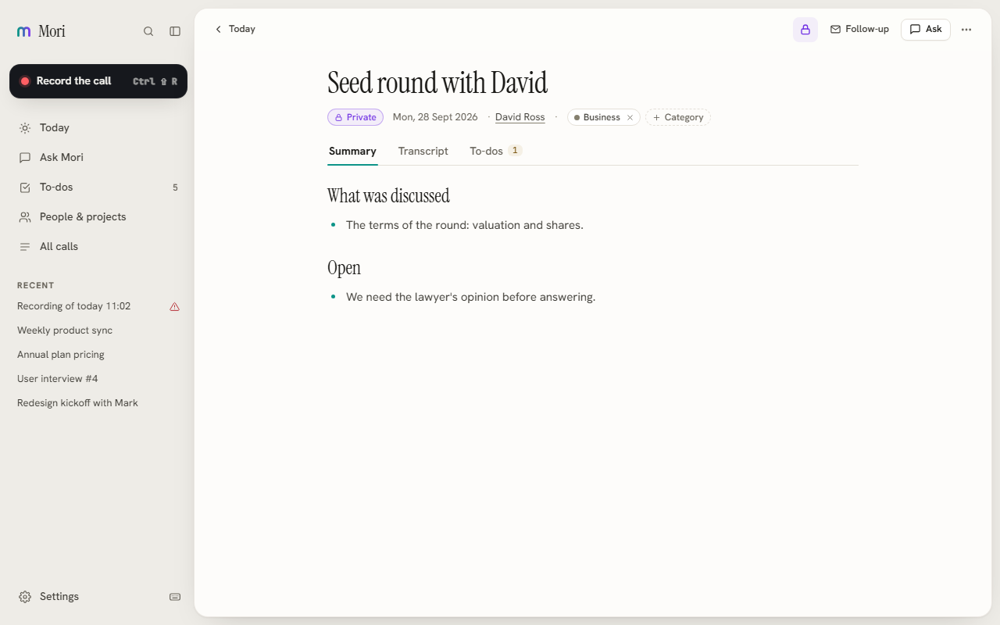
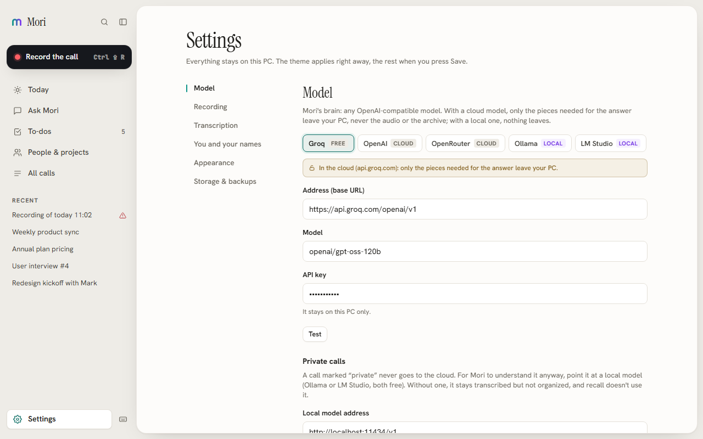
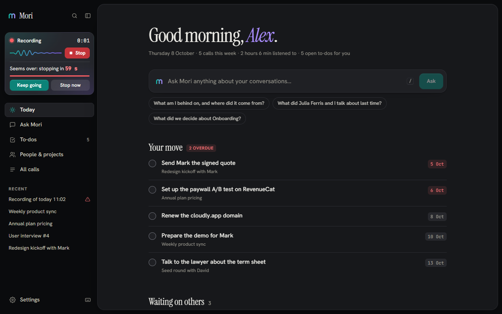
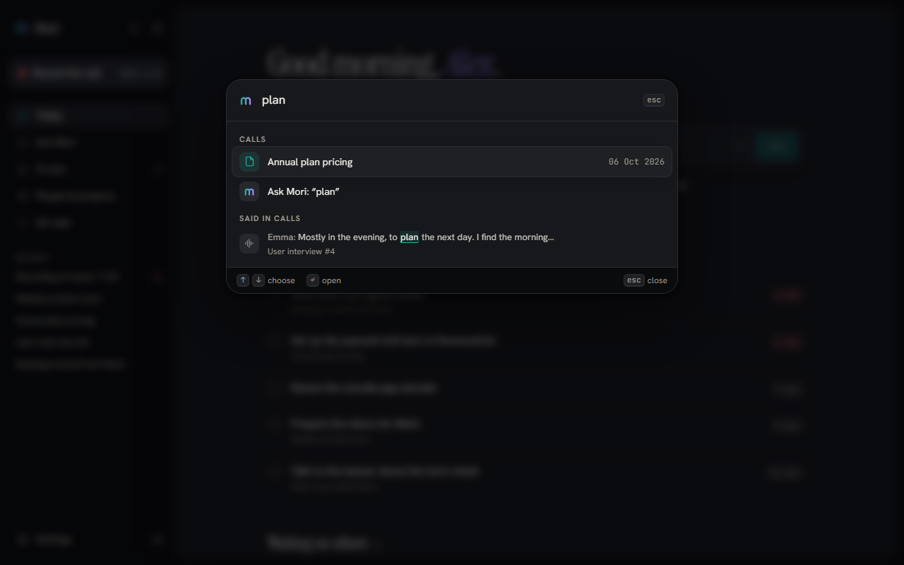

# Mori

[](https://github.com/LorenzoAlejandroMontes/mori-app/actions/workflows/ci.yml) [](LICENSE)

**Mori remembers your calls for you.** It listens to your meetings (you on the mic, everyone else from the computer's audio), transcribes them, and turns them into what you actually need afterwards: a summary, the decisions, who promised what by when, and answers to "what did we agree with Marco?", with the call it comes from one click away.

> 🇮🇹 Mori è un compagno per le tue call: registra, trascrive, ricorda persone, decisioni e cose da fare, e risponde citando la call giusta. L'interfaccia è in inglese o in italiano, a scelta.



## What it does

- **Records any call**: Meet, Zoom, Teams, a phone on speaker: from a global hotkey or the tray, without joining as a bot. Your voice and the others' are kept on separate channels, so the transcript knows who said what.
- **Transcribes locally** with Whisper (`large-v3-turbo`, greedy decoding, batched on 8+ cores), in the background, at idle priority, and shows it happening: a line that fills, the percentage and the time left, in the sidebar, on the call and in the always-on-top pill. **By default, in seconds and for free** with Groq's `whisper-large-v3-turbo` (the same key as the model): only the *speech* leaves the PC (silence is cut locally), never for a private call, and it falls back to the local Whisper without a key or on any error. One click in *Settings → Transcription* keeps everything on the PC.
- **Doesn't hoard audio**: by default the recording is deleted as soon as the transcript is safely saved. Keep it on the PC, or in a folder you choose (OneDrive/Google Drive with files on demand), if you want to replay lines; *Free up space* clears what was kept before.
- **Says where it is and when it's done**: after the words, "Understanding" (which part of a long call, or how many seconds the free tier asks to wait), then *“Product sync” is ready · 3 to-dos · Open*, as a toast in Mori or in the pill when Mori is behind. On Groq the pieces of a long call go to `gpt-oss-20b` (its own per-minute budget, twice as fast), the final pass to the model you chose.
- **Understands the call**: summary, decisions with figures, action items with *real* due dates ("Thursday" said on a Monday becomes a date), commitments and durable facts about people and projects. A 90‑minute call is not squeezed into five bullet points.
- **Today**, the page it opens on: what is yours and due (late first), what others owe you, the calls still to be understood, and questions worth one click, built from your own archive.
- **Ask Mori**: hybrid recall (BM25 + local embeddings, fused) over every call, answers streamed as they are written, with citations that open the call at the right minute.
- **Find what was said**: ⌘K searches every transcript for a phrase (accents and case don't matter) and opens the call at that second. Tell Mori who "the other voice" was and the name is used everywhere: transcript, search, recall, summaries.
- **Before and after a call**: a brief on the person you are about to meet ("last time you agreed…"), and a follow-up email drafted from the extracted facts: ready to paste, never sent by Mori.
- **Italian or English**, following the system or your choice: the interface, and what the model writes for you (summaries, to-dos, answers, emails).
- **Light or dark**, following the system or your choice: both WCAG AA, checked on every screen.
- **Made for the keyboard**: ⌘K reaches every call, sentence, person, section and setting; `Ctrl 1…5` jump between sections, `J`/`K` between calls, `?` shows every shortcut. Deleting asks nothing: it offers **Undo**.
- **Tells you during the call if a side goes dead**: the two-voices wave follows the real levels of your mic and of the PC's audio, and "I can't hear the other side" / "I can't hear you" / "the microphone stopped" shows up in the recorder (and the pill) while there is still time to fix it.
- **One place to see it's recording**: the control at the top of the sidebar (with the two voices, teal and violet) or, with Mori behind other windows, a small always-on-top pill.
- **Yours, in plain files**: copy any call as Markdown, export the whole archive to `.md`, daily verified database snapshots, an optional second backup folder (e.g. one synced by OneDrive).

| | |
|---|---|
|  |  |
|  |  |
|  |  |

<sub>Screenshots use invented data from the preview bench (`app/preview/fixtures.ts`). The design rules: [`docs/DESIGN.md`](docs/DESIGN.md).</sub>

## Platforms

| Platform | Status |
|---|---|
| **Windows** | Works today. This is where Mori is used every day. |
| **macOS** | Apple Silicon, macOS 14.2+. The download is signed and notarized. Every release is proven on GitHub's cloud Mac (macOS 26): the app is taken out of the `.dmg`, prepares its own Python, records both sides of a played call and transcribes it. Still to come: someone using it on a Mac on their desk. Where to help: [`docs/MACOS.md`](docs/MACOS.md). |
| Linux | The app builds and the checks run in CI. Untested beyond that. |

## Install

Download the file for your computer from the [latest release](https://github.com/LorenzoAlejandroMontes/mori-app/releases/latest):

- **Windows**: `Mori_<version>_x64-setup.exe`, an installer for the current user.
- **macOS, Apple Silicon**: `Mori_<version>_aarch64.dmg`. Open it, drag Mori to Applications, open Mori. It is signed with an Apple Developer ID and notarized by Apple, so macOS asks once whether to open an app downloaded from the internet, and that is all. How that build is made: [docs/RELEASING.md](docs/RELEASING.md).

You do not need to install Python: on first launch Mori downloads its own into `~/.mori` (about 300 MB with the audio and transcription libraries, once) and says how far it is under the record button. The other way is to run Mori from source (below).

## Privacy, by construction

| Data | Where it goes |
|---|---|
| Audio | Your PC only, and by default not even there once the transcript is saved. Optionally kept on the PC or in a folder you pick. |
| Transcription | Groq's free Whisper by default (only the speech is sent, never for private calls; Groq does not train on it): or your PC only (Whisper via faster-whisper), one click away and automatic without a Groq key. |
| Semantic index | Your PC only (ONNX embeddings via fastembed, no torch). |
| Database | `~/.mori/mori.db`, a plain SQLite file on your disk. |
| Questions & understanding | Only the **relevant snippets** go to the model you choose: never the archive, never the audio. |
| **Private calls** 🔒 | Never leave the PC. They are read only by a local model (Ollama, LM Studio); with a cloud model they are excluded from recall, briefs and follow-ups. Enforced in two independent places and covered by tests. |

The model is any OpenAI‑compatible endpoint: Groq (free tier, no training on your data), OpenAI, OpenRouter, or a model running on your own machine, in which case **nothing** leaves it. Fonts and assets are bundled: apart from the model you configured, the only network traffic is the one-time download of the Whisper and embedding models.

## How it works

```
 record.py ──► transcribe*.py ──► organize ──► index ──► recall / Today / brief
 (mic + loopback)  (Whisper, local)  (LLM, JSON)  (chunks + local embeddings)
        ▲                 └──────── durable job queue (SQLite) ────────┘
   Tauri (Rust): spawns the Python sidecars at idle priority, tray, hotkey, pill window
```

- **Shell**: Tauri v2 (Rust): `app/src-tauri`. Every command that does real work runs off the UI thread.
- **App**: React + TypeScript: `app/src`. State lives in SQLite through `@tauri-apps/plugin-sql`; numbered migrations in `app/src-tauri/migrations`.
- **Sidecars**: Python: `app/scripts` (`record.py`, `transcribe*.py`, `embed.py`, `toflac.py`).
- **Pipeline**: every step (transcribe → organize → index → compress) is a row in a durable job queue: it survives a crash or a closed app, retries with backoff, and a failure shows a *Try again* button instead of being lost.

## Getting started (development)

Prerequisites: Node 22, pnpm 10, Rust (stable), Python 3.11+. Mori is used every day on **Windows** (system audio is captured through WASAPI loopback). On **macOS** 14.2+ a small Swift helper captures it through Core Audio process taps: [`docs/MACOS.md`](docs/MACOS.md). The backend also builds on Linux; capturing the other side of a call there needs a loopback device and is untested.

```bash
cd app
pnpm install

# Python sidecars (recording, Whisper, embeddings): once.
# Windows:      py -3 -m venv .venv && .venv\Scripts\pip install -r requirements.txt
# macOS/Linux:  python3 -m venv .venv && .venv/bin/pip install -r requirements.txt
# (a venv in ~/.mori/venv is found too)

pnpm tauri dev                    # run (installs missing dependencies first)
pnpm tauri build --no-bundle      # a standalone exe in src-tauri/target/release
```

Then open *Settings → Model* (`Ctrl ,`), pick a preset (Groq, OpenAI, OpenRouter, Ollama, LM Studio) and press **Test**.

Everything Mori keeps lives in `~/.mori`: `mori.db`, `audio/`, `backups/`, `export/`, `models/`.

## Checks

```bash
cd app
pnpm exec tsc --noEmit -p tsconfig.json   # types
node scripts/checks.mjs                   # ~340 checks: the REAL modules against the REAL schema on a throwaway SQLite
node tests/todo-logic.test.ts && node tests/companion-logic.test.ts
node scripts/contrast.mjs                 # every color pair of the design tokens, WCAG AA, light and dark
cd src-tauri && cargo test --locked       # Rust
```

The **preview bench** runs the whole app in a browser, on a real in-browser SQLite (sql.js) built from the migrations plus invented data: no Tauri, no `~/.mori`:

```bash
pnpm exec vite build --config vite.preview.config.ts
pnpm exec vite preview --config vite.preview.config.ts --port 5199
# http://localhost:5199/            the app
# http://localhost:5199/?fresh=1    a brand-new install

# with Playwright installed (npm i -g playwright):
node preview/flows.mjs http://localhost:5199   # the main flows in a real browser: record, ask, cite, private, follow-up, ⌘K, keyboard…
node preview/audit.mjs http://localhost:5199   # axe-core, WCAG 2.1 AA, every screen, light and dark
node preview/clip.mjs http://localhost:5199    # no text cut by its own box (the tail of a "g")
node scripts/i18n-check.mjs                    # every t("…") has its English
node preview/shoot.mjs http://localhost:5199 ../shots   # screenshots at 820, 1040, 1440 px
```

CI (`.github/workflows/ci.yml`) runs the types, the checks, the tests and the Rust tests on every pull request.

## Repository

```
app/src            React app (views/, ui/, recall, organize, jobs, …)
app/src-tauri      Rust shell, migrations, capabilities
app/scripts        Python sidecars + checks.mjs
app/preview        the preview bench (fixtures are invented)
docs/              design rules, the macOS plan, screenshots
DECISIONS.md       the founding decisions (privacy, data model, backups)
```

## Contributing

Read [`CONTRIBUTING.md`](CONTRIBUTING.md) first: six house rules keep recordings safe and the interface fast. The most wanted help right now is macOS: see [`docs/MACOS.md`](docs/MACOS.md). Security reports: [`SECURITY.md`](SECURITY.md).

## License

[MIT](LICENSE). What Mori builds on is credited in [`THIRD_PARTY.md`](THIRD_PARTY.md).
